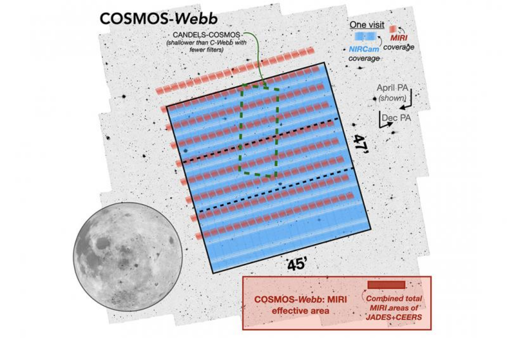

# **Extragalactic Deep Legacy Fields**

**http://www.iap.fr/jwst-edls/index.html**

# GO Cycle 1 program

 

## **The Webb Deep Extragalactic Exploratory Public (WDEEP) Survey**

**From SAZERAC 2021 | 1A | Casey Papovich https://www.youtube.com/watch?v=ZkZZeImZM-8**

**HUDF: NIRISS WFSS (grisms R, C - 115W, 150W, 200W) + NIRCam (115W, 150W, 200W, 277W, 356W, 444W)**

## **PRIMER: Public Release IMaging for Extragalactic Research**

**From SAZERAC 2021 | 1B | James Dunlop https://www.youtube.com/watch?v=h9UON04fsEM**

**UDS+COSMOS: NIRCam (090W, 115W, 150W, 200W, 277W, 356W, 410W, 444W) + MIRI (770W, 1800W)**

## **UNCOVER: Ultra-deep NIRCam and NIRSpec Observations Before the Epoch of Reionization**

**From SAVERAC 2021 | 1A | Ivo Labbe https://www.youtube.com/watch?v=JBGP4UfaSfI**

**A2744: NIRCam (F115W, F150W, F200W, F277W, F356W, F444W, F410M), NIRSpec MOS (PRISM)**

## COSMOS-Web: The JWST Cosmic Origins Survey

**Cosmos: NIRCam (115W, 150W, 277W, 444W) + MIRI (770W)**

## **FRESCO: The First Reionization Epoch Spectroscopic COmplete Survey**

**From SAZERAC2021 | 1A | Pascal Oesch https://www.youtube.com/watch?v=PypKg5r1Xks**

**GOODS North + GOODS South: NIRCam WFSS (444W)**

# GTO program

## **The CAnadian NIRISS Unbiased Cluster Survey**

**https://niriss.github.io/index.html**

**MUSE + ALMA + GLASS/CLASH/RELICS/HFF**

**NIRISS Wide-Field Slitless Spectroscopy (WFSS), NIRCam Imaging,NIRSpec Multi-Object R=100 Spectroscopy**

## **JWST NEP Time-Domain Community Field**

**http://lambda.la.asu.edu/jwst/neptdf/index.html; https://arxiv.org/pdf/1807.05278.pdf**

## **The NIRSpec GTO Programme**

### **The NIRCam-NIRSpec GTO galaxy assembly survey**

**https://issues.cosmos.esa.int/jwst-nirspecwiki/display/PUBLIC**

## **MIRI in the HUDF**

**https://www.astro.rug.nl/~galpatagonia/GALPAT_PRESENTATIONS/RiekeGeorge_argentina_talk_rev.pdf**

# ERS

## **Through the Looking GLASS: A JWST Exploration of Galaxy Formation and Evolution from Cosmic Dawn to Present Day**

## **The Cosmic Evolution Early Release Science (CEERS) Survey**

**EGS Field**

## **ERS: TEMPLATES: Targeting Extremely Magnified Panchromatic Lensed Arcs and their Extended Star formation**

**NIRSpec IFU Spectroscopy + NIRCam Imaging + MIRI Imaging + MIRI Medium Resolution Spectroscopy**

**Already: ALMA + HST**

